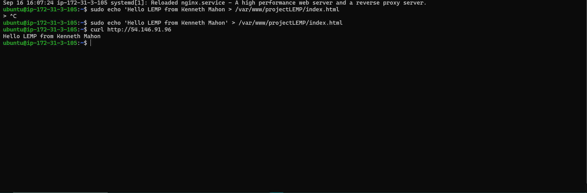
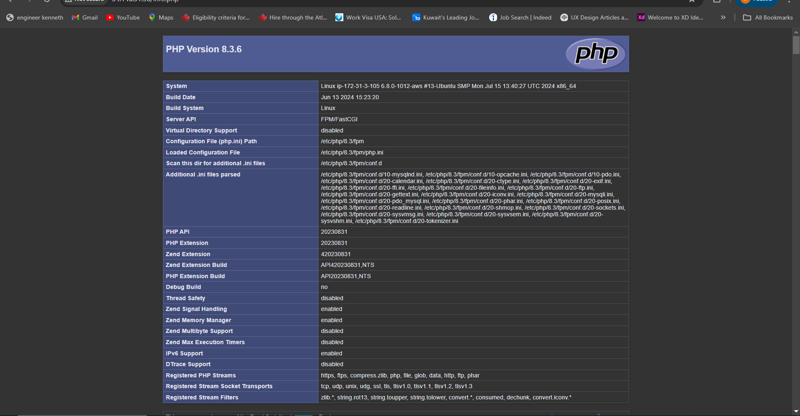

# WEB STACK IMPLEMENTATION (LEMP STACK) IN AWS

## Introduction

LEMP is an open-source web application stack used to develop web applications. The term LEMP is an acronym that represents:

- **L** - Linux Operating System
- **E** - Nginx Server (pronounced as engine-x, hence the E in the acronym)
- **M** - MySQL Database
- **P** - PHP

LEMP benefits from strong community support and is employed globally in numerous highly-scaled web applications. Nginx ranks as the second most utilized web server globally, trailing only Apache in popularity.

## How does the LEMP Stack work?

The LEMP stack operates by employing Nginx as its web server, responsible for receiving HTTP requests and directing them to the relevant PHP script. These PHP scripts generate responses, which are subsequently delivered back to the user through Nginx.

MySQL serves as the database management system for storing and organizing the website's data. PHP interacts with MySQL to fetch and store data as required.

## Why is the LEMP Stack popular in web development?

The LEMP stack garners popularity in web development for several compelling reasons:

1. **Exceptional Performance**: Nginx stands out for its remarkable performance, rendering it an optimal solution for managing extensive traffic loads effectively.

2. **Scalability**: Renowned for its scalability, the LEMP stack proves advantageous for websites requiring robust handling of substantial visitor traffic.

3. **Open-Source Nature**: Each component of the LEMP stack is open-source, rendering it a cost-effective solution for web developers.

4. **Adaptability**: Offering flexibility, the LEMP stack can be tailored to suit the specific requirements of any given website.

5. **Enhanced Security**: Renowned for its robust security measures, the LEMP stack, bolstered by Nginx, incorporates various security features such as SSL encryption and DDoS protection.

## Implementation Steps

### Prerequisites

1. Launch an EC2 Instance of t2.micro type with Ubuntu 24.04 LTS (HVM) in your chosen AWS region.
2. Create an SSH key pair named lempServer to access the instance on port 22.
3. Configure the security group with the following inbound rules:
   - Allow traffic on port 80 (HTTP) from anywhere on the internet.
   - Allow traffic on port 443 (HTTPS) from anywhere on the internet.
   - Allow traffic on port 22 (SSH) from any IP address.
4. Use the default VPC and Subnet for networking configuration.
5. Connect to your instance using SSH.

### Step 1 - Install the Nginx Web Server

1. Update server's package index:
   ```
   sudo apt update
   sudo apt install nginx
   ```

2. Verify that Nginx was successfully installed:
   ```
   sudo systemctl status nginx
   ```


3. Test Nginx response locally:
   ```
   curl http://localhost:80
   ```


4. Test Nginx response from the internet using the public IP address.
```
http://<public-ip>
```


### Step 2 - Install MySQL

1. Install MySQL:
   ```
   sudo apt install mysql-server
   ```

2. Enable and verify MySQL is running:
   ```
   sudo systemctl enable --now mysql
   sudo systemctl status mysql
   ```

3. **Log in to mysql console**

   ```
   sudo mysql
   ```

   This connects to the MySQL server as the administrative database user **root** inferred by the use of **sudo** when running the command.

4. **Set a password for root user using mysql_native_password as default authentication method.**
   Here, the user's password was defined as "PassWord.1"

   ```
   ALTER USER 'root'@'localhost' IDENTIFIED WITH mysql_native_password BY 'PassWord.1';
   ```

   Exit the MySQL shell

   ```
   exit
   ```

5. **Run an Interactive script to secure MySQL**
   The security script is pre-installed with MySQL. It's designed to eliminate certain insecure settings and restrict access to the database system.

   ```
   sudo mysql_secure_installation
   ```

   Regardless of whether the **VALIDATION PASSWORD PLUGIN** is configured, the server will prompt you to choose and confirm a password for the MySQL root user.

6. **After changing root user password, log in to MySQL console.**
   After executing the command below, a command prompt for entering a password was observed.

   ```
   sudo mysql -p
   ```

   Exit MySQL shell

   ```
   exit
   ```

### Step 3 - Install PHP

1. Install PHP and necessary modules:
   ```
   sudo apt install php-fpm php-mysql
   ```

2. Confirm the PHP version
  ```
   php -v
   ```

### Step 4 - Configuring Nginx to Use PHP Processor
When using the Nginx web server, we can create server blocks to isolate configuration details and host more than one domain on a single server.

The default directory serving the Nginx default page is `/var/www/html`. Create your document directory next to the default one.

1. Create the root web directory for **your_domain** using the "mkdir" command:

   ```
   sudo mkdir /var/www/projectLEMP
   ```

2. Then assign ownership of the directory with the $USER environment variable, which will reference the current system user:

   ```
   sudo chown -R $USER:$USER /var/www/projectLEMP
   ```

3. Open a new configuration file in Nginx's **sites-available** directory using your preferred command-line editor.

   ```
   sudo nano /etc/nginx/sites-available/projectLEMP
   ```

   This will create a blank file. Paste in the following bare-bone configuration:

   ```
   # /etc/nginx/sites-available/projectLEMP

   server {
       listen 80;
       server_name projectLEMP www.projectLEMP;
       root /var/www/projectLEMP;

       index index.html index.htm index.php;

       location / {
           try_files $uri $uri/ =404;
       }

       location ~ \.php$ {
           include snippets/fastcgi-php.conf;
           fastcgi_pass unix:/var/run/php/php7.4-fpm.sock;
        }

       location ~ /\.ht {
           deny all;
       }
   }
   ```

   **Note:** After making changes in the editor, you can save the file by pressing Ctrl + O, then press Enter to confirm the filename, and finally Ctrl + X to exit nano.

4. Activate your configuration by linking to the config file from Nginx's **sites-enabled** directory:

   ```
   sudo ln -s /etc/nginx/sites-available/projectLEMP /etc/nginx/sites-enabled/
   ```

   **Note:** The purpose of this command is to enable the server configuration file for your domain by creating a symbolic link to it in the sites-enabled directory.

5. Test your configuration for syntax errors by typing:

   ```
   sudo nginx -t
   ```

6. Disable default Nginx host that is currently configured to listen on port 80, for this run:

   ```
   sudo unlink /etc/nginx/sites-enabled/default
   ```

7. Reload Nginx to apply changes:

   ```
   sudo systemctl reload nginx
   ```

8. Your new website is now active, but the web root `/var/www/projectLEMP` is still empty. Create an index.html file in that location so that we can test that your new server block works as expected:

   ```
   sudo echo 'Hello LEMP from hostname' > /var/www/projectLEMP/index.html
   ```

   

8. Now go to your browser and access your server's domain name or IP address, as listed within the `server_name` directive in your server block configuration file:

   ```
   http://your_domain_or_IP_address
   ```

   


## Step 5 – Testing PHP with Nginx

Your LEMP stack setup is now complete. You can verify its functionality by testing whether Nginx properly passes .php files to your PHP processor.

You can do this by creating a test PHP file in your document root.

1. Open a new file called **info.php** within your document root in your text editor:

   ```
   sudo nano /var/www/projectLEMP/info.php
   ```

Type or paste the following lines into the new file. This is valid PHP code that will return information about your server:

   ```
   <?php
   phpinfo();
   ?>
   ```

2. You can now access this page in your web browser by visiting the domain name or public IP address you've set up in your Nginx configuration file, followed by /info.php:

   ```
   http://<public-ip>/info.php
   
   ```

   

3. After reviewing the pertinent details of your PHP server via that page, it's advisable to delete the file you generated since it harbors sensitive information regarding your PHP setup and your Ubuntu server. To accomplish this, you can utilize the `rm` command to delete the file:

   ```
   sudo rm /var/www/projectLEMP/info.php
   ```

## Step 6 — Retrieving data from MySQL database with PHP

1. First, connect to the MySQL console using the root account:

   ```
   sudo mysql -u root -p
   ```

2. To create a new database, run the following command from your MySQL console:

   ```sql
   mysql> CREATE DATABASE example_database;
   ```

3. The following command creates a new user named **example_user**, using    mysql_native_password as default authentication method:

   ```sql
   mysql> CREATE USER 'example_user'@'%' IDENTIFIED WITH mysql_native_password BY 'PassWord.1';
   ```

   ```sql
   mysql> GRANT ALL ON example_database.* TO 'example_user'@'%';
   ```

4. Exit the MySQL shell with:

   ```sql
   mysql> exit
   ```

5. You can test if the new user has the proper permissions by logging in to the MySQL console again, this time using the custom user credentials:

   ```
   mysql -u example_user -p
   ```

6. Confirm that you have access to the steghub_DB database:

   ```sql
   mysql> SHOW DATABASES;
   ```

   

7. I'll create a test table named todo_list. From the MySQL console, run the following statement:

   ```sql
   mysql> CREATE TABLE steghub_DB.todo_list (
   mysql> item_id INT AUTO_INCREMENT,
   mysql> content VARCHAR(255),
   mysql> PRIMARY KEY(item_id)
   );
   ```

8. Insert a few rows of content in the test table. You might want to repeat the next command a few times, using different values:

   ```sql
   mysql> INSERT INTO example_database.todo_list (content) VALUES ("My first important item");
   ```

9. To confirm that the data was successfully saved to your table, run:

   ```sql
   mysql> SELECT * FROM example_database.todo_list;
   ```
```
Output
+---------+--------------------------+
| item_id | content                  |
+---------+--------------------------+
|       1 | My first important item  |
+---------+--------------------------+
1 row in set (0.00 sec)
```

9. After confirming that you have valid data in your test table, you can exit the MySQL console:

   ```sql
   mysql> exit
   ```

Now you can create the PHP script that will connect to MySQL and query for your content.

10. Create a new PHP file in your custom web root directory using your preferred editor. We'll use nano for that:

    ```
    nano /var/www/projectLEMP/todo_list.php
    ```

    The following PHP script connects to the MySQL database and queries for the content of the todo_list table, exhibiting the results in a list. If there's a problem with the database connection, it will throw an exception.

11. Copy this content into your todo_list.php script:

    ```php
    <?php
    $user = "example_user";
    $password = "password";
    $database = "example_database";
    $table = "todo_list";

    try {
      $db = new PDO("mysql:host=localhost;dbname=$database", $user, $password);
      echo "<h2>TODO</h2><ol>"; 
      foreach($db->query("SELECT content FROM $table") as $row) {
        echo "<li>" . $row['content'] . "</li>";
      }
      echo "</ol>";
    } catch (PDOException $e) {
        print "Error!: " . $e->getMessage() . "<br/>";
        die();
    }
    ```

    *Save and close the file when you're done editing.*

12. You can now access this page in your web browser by visiting the domain name or public IP address configured for your website, followed by /todo_list.php:

    ```
    http://<public-ip>/todo_list.php
    ```

    

That means your PHP environment is ready to connect and interact with your MySQL server.

## Conclusion

We’ve built a robust foundation for delivering PHP-based websites and applications, utilizing Nginx for efficient web serving and MySQL for reliable database management. This setup ensures optimal performance and scalability, providing a seamless experience for both developers and end-users.